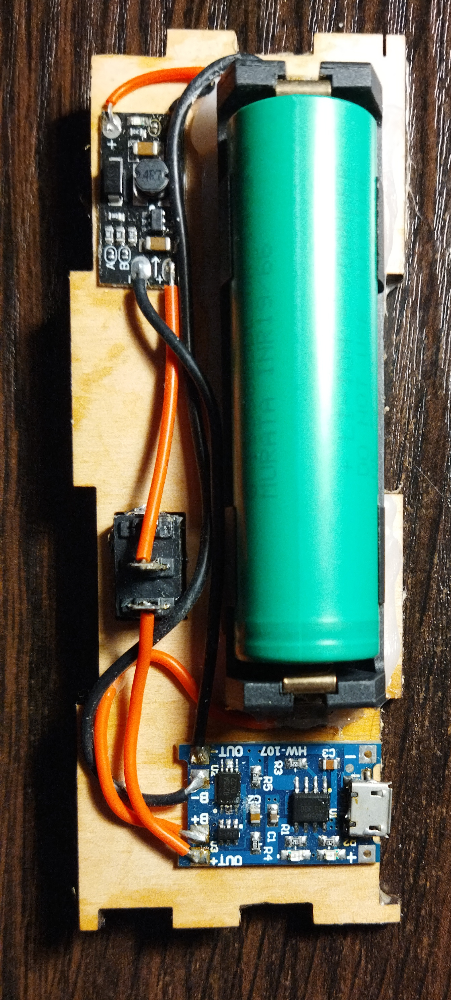
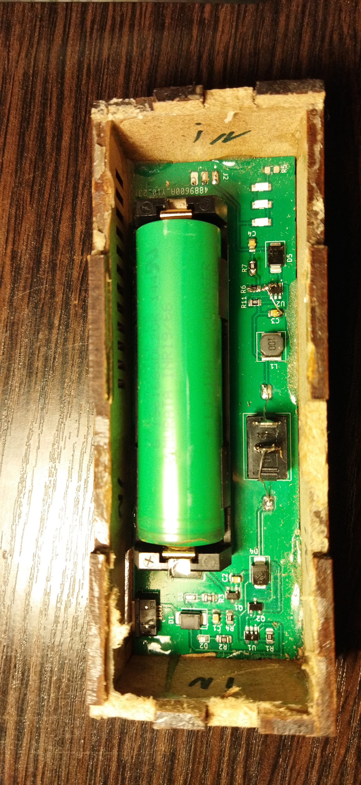
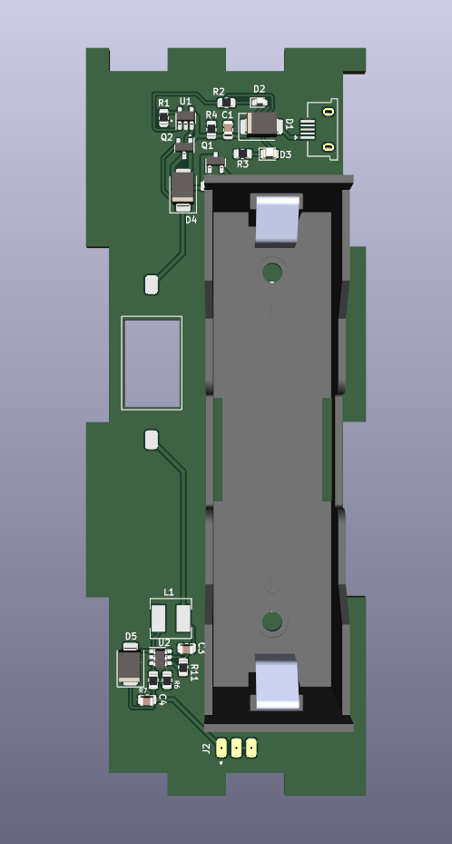

# Flashlight PCB design with wooden casing

Kicad PCB design for my wooden flashlight V1 (see https://github.com/dizcza/lasercut_collection). Originally designed by HackLabKyiv residents.

An ordinary 12V LED strip is soldered to the front side of the PCB.

<table>
  <tr>
   <td></td>
   <td></td>
  </tr>
</table>

## Schematics

[schematics.pdf](schematics.pdf)

## Revisions

<table>
  <tr>
   <th>V1</th>
   <th>V2.1</th>
   <th>V2.2</th>
  </tr>
  <tr>
   <td></td>
   <td></td>
   <td></td>
  </tr>
</table>

## BOM

|Comment     |Designator |Footprint                      |JLC Part #|
|------------|-----------|-------------------------------|----------|
|Battery_Cell|BT1        |FlashlightLib:BH-18650         |C2988620  |
|22uF/25V    |C1,C2,C3,C4|Capacitor_SMD:C_0805_2012Metric|C45783    |
|D_Schottky  |D1,D4,D5   |Diode_SMD:D_SMB                |C22452    |
|RED         |D2         |LED_SMD:LED_0603_1608Metric    |C2286     |
|GREEN       |D3         |LED_SMD:LED_0805_2012Metric    |C2297     |
|USB_B_Micro |J1         |FlashlightLib:USB-1101IPX6-02  |C2858269  |
|10uH        |L1         |FlashlightLib:L_5.0x5.0        |C2849501  |
|HSS2333     |Q1,Q2      |Package_TO_SOT_SMD:SOT-23      |C845590   |
|1k          |R1,R2,R3   |Resistor_SMD:R_0805_2012Metric |C17513    |
|10k         |R4,R6,R11  |Resistor_SMD:R_0603_1608Metric |C25804    |
|200k        |R7         |Resistor_SMD:R_0603_1608Metric |C25811    |
|LP4054HB5F  |U1         |Package_TO_SOT_SMD:SOT-23-5    |C517187   |
|MT3608      |U2         |Package_TO_SOT_SMD:SOT-23-6    |C84817    |

## Casing

Can be lasercut or 3d-printed.

DXF file: [casing.dxf](./casing/casing.dxf)

OpenSCAD design file: https://github.com/dizcza/lasercut_collection/blob/master/Lampa.scad

