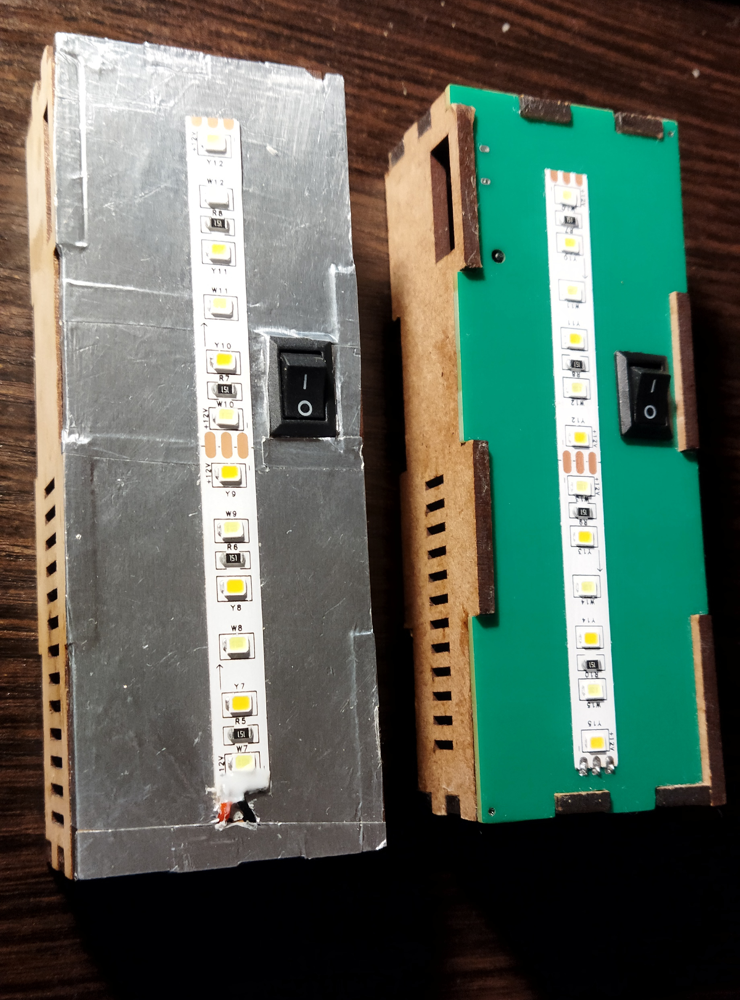

# Flashlight PCB design with wooden casing

Kicad PCB design for my wooden flashlight V1 (see https://github.com/dizcza/lasercut_collection). Originally designed by HackLabKyiv residents.

An ordinary 12V LED strip is soldered to the front side of the PCB.

<table>
  <tr>
   <td></td>
   <td></td>
  </tr>
</table>

## Schematics

[schematics.pdf](schematics.pdf)

## Revisions

<table>
  <tr>
   <th>V1</th>
   <th>V2.1</th>
   <th>V2.2</th>
  </tr>
  <tr>
   <td></td>
   <td></td>
   <td></td>
  </tr>
</table>

## BOM

|Comment             |Designator|Footprint                      |LCSC    |
|--------------------|----------|-------------------------------|--------|
|22uF/25V            |C1,C3,C4  |Capacitor_SMD:C_0805_2012Metric|C45783  |
|1uF                 |C2        |Capacitor_SMD:C_0603_1608Metric|C15849  |
|D_Schottky          |D1,D4,D5  |Diode_SMD:D_SMB                |C22452  |
|USB_B_Micro         |J1        |FlashlightLib:USB-1101IPX6-02  |C2858269|
|10uH                |L1        |FlashlightLib:L_5.0x5.0        |C2849501|
|HSS2333             |Q2        |Package_TO_SOT_SMD:SOT-23      |C15127  |
|1k                  |R1,R2,R3  |Resistor_SMD:R_0603_1608Metric |C21190  |
|10k                 |R4,R6     |Resistor_SMD:R_0603_1608Metric |C25804  |
|200k                |R7        |Resistor_SMD:R_0603_1608Metric |C25811  |
|XB4908A             |U1        |FlashlightLib:XB4908A          |C2998740|
|MT3608              |U2        |Package_TO_SOT_SMD:SOT-23-6    |C84817  |
|TP4057              |U3        |Package_TO_SOT_SMD:TSOT-23-6   |C12044  |
|R6BHC-A05_LED-19-223|U4        |MyFootprints:R6BHC-A05_LED     |C131286 |

## Casing

Can be lasercut or 3d-printed.

DXF file: [casing.dxf](./casing/casing.dxf)

OpenSCAD design file: https://github.com/dizcza/lasercut_collection/blob/master/Lampa.scad

